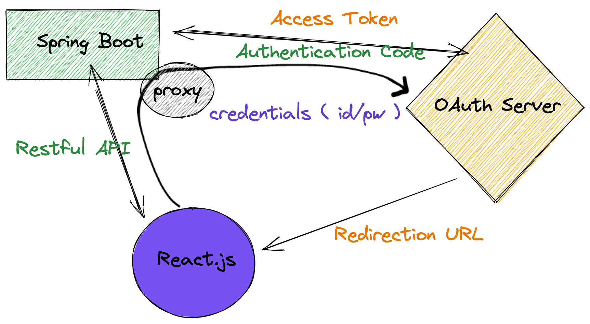
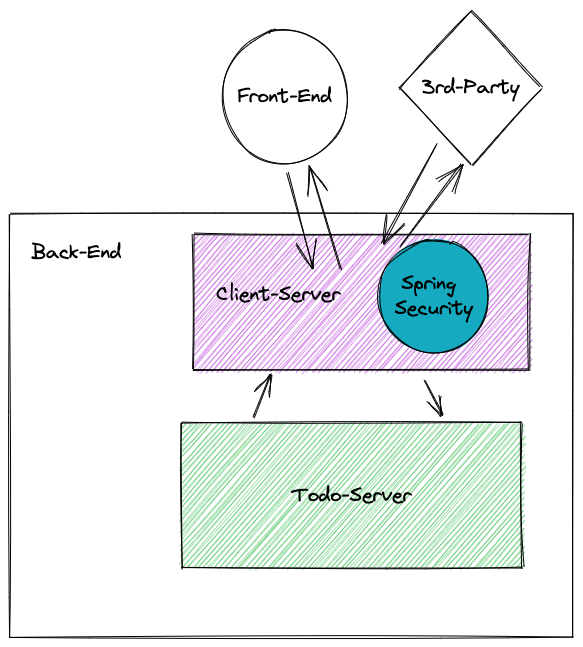
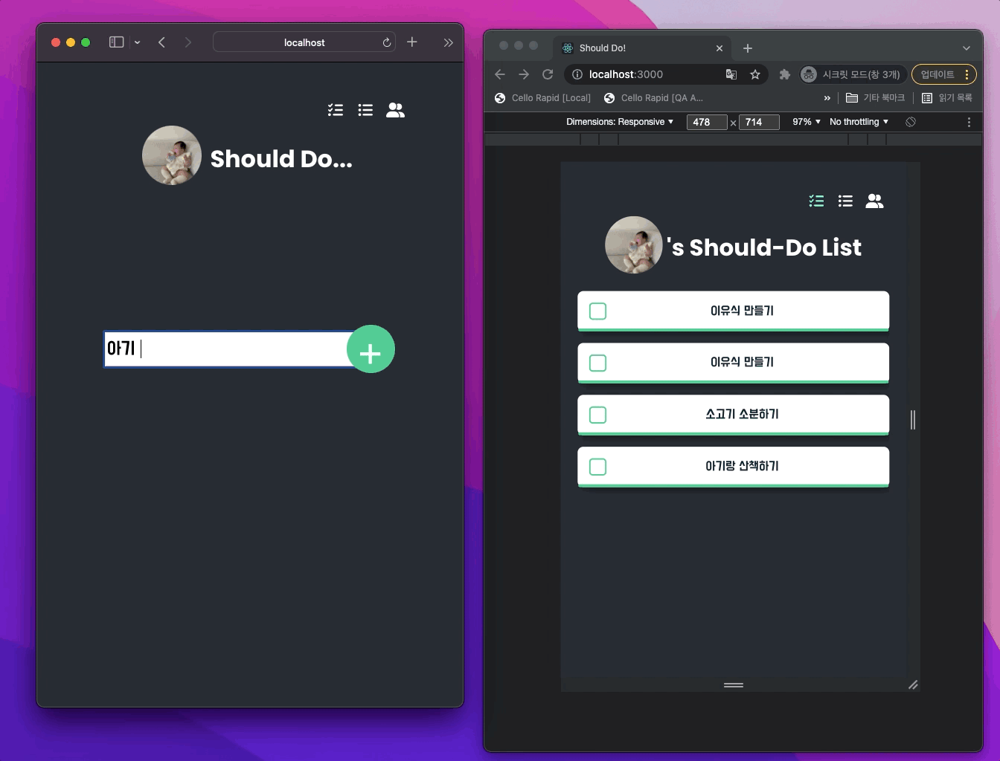
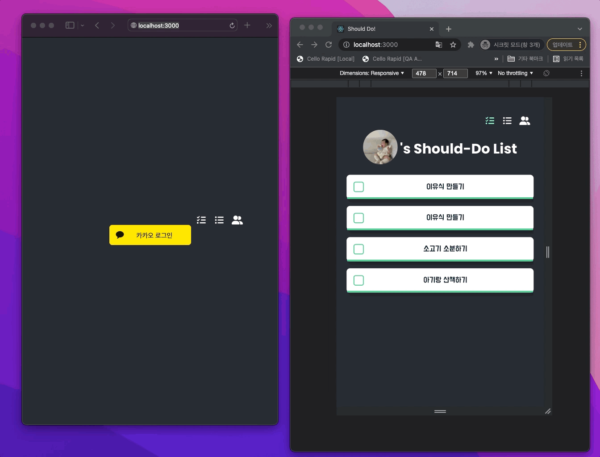
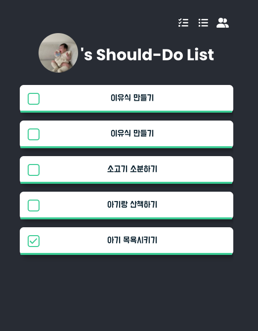
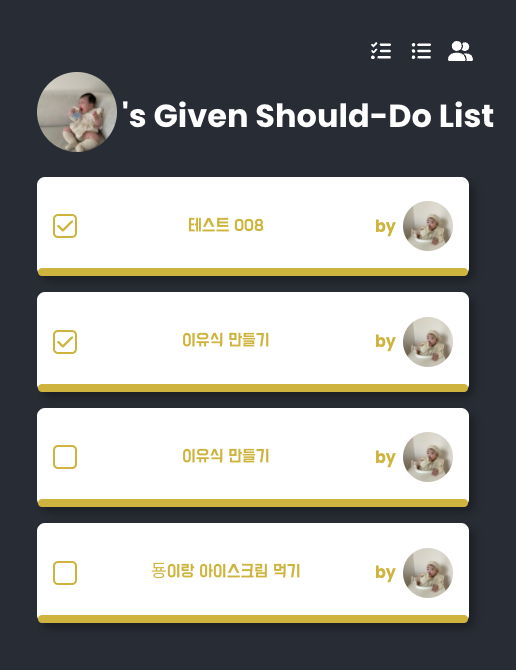
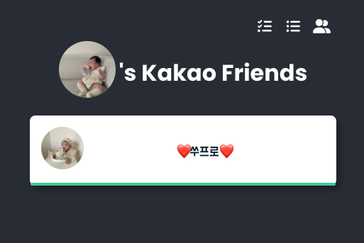
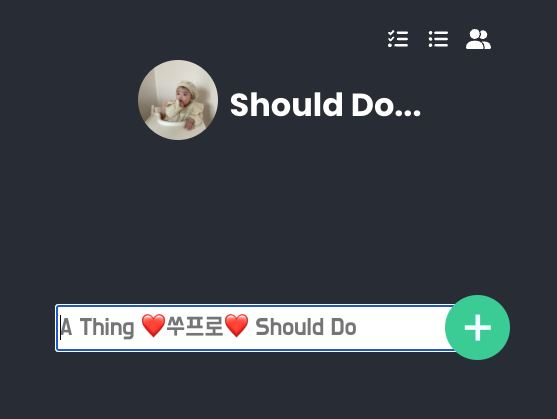
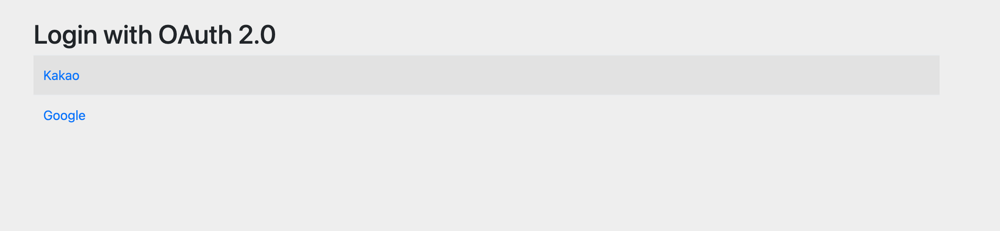
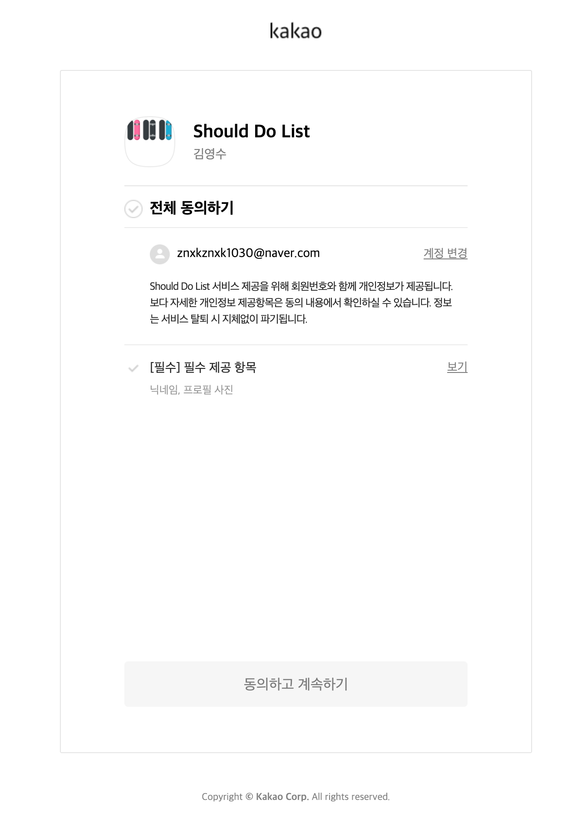

# Should Do List

## 프로젝트 구조




## Demo



## 카카오 로그인



## 나의 Should-Do 목록 확인하기



## 내가 준 Should-Do 목록 진행사항 확인하기



## 친구리스트 ( 카카오 )



## Should Do 만들기



## Run

```bash
./run.bash
```

## Build

```bash
mvn clean package
```

## Volume 설정

### docker-compose.yml

- 공백에 예민하니 todo-data:[공백]/var/lib.mysql에서 [공백]을 꼭 없애야 한다.

```yml
  mysql:
    ...
    volumes:
      - todo-data:/var/lib/mysql

volumes:
  todo-data:
```

### inspect

```bash
docker volume ls
docker volume inspect spring-kata-1_todo-data
```

## application.yml 파일 분리하기

[[SOF] Spring Boot: how to use multiple yml files ](https://stackoverflow.com/questions/23134869/spring-boot-how-to-use-multiple-yml-files)

```yml
# import application-oauth.yml
spring.profiles.include: oauth
```

## [spring-boot-starter-oauth2-client] google redirection url 설정

- http://localhost:8080/login/oauth2/code/google

```yml
# application-oauth.yml

spring:
  security:
    oauth2:
      client:
        registration:
          google:
            client-id: << GOOGLE CLIENT ID >>
            client-secret: << GOOGLE CLIENT SECERT >>
            scope: profile,email
```


## 카카오 OAuth 이용하기

[[Spring] 스프링으로 OAuth2 로그인 구현하기3 - 카카오](https://loosie.tistory.com/302#h2)

## OAuth 로그인 디폴트 화면



<!--  -->

## Error List

### No default constructor for entity

Entity 클래스에 @NoArgsConstructor 추가

```java
@NoArgsConstructor
```

### Lombok과 Mapstruct를 같이 사용할경우 Mapstruct가 생성하는 코드에서 getter, setter함수를 찾지 못하는 문제

1. Lombok Mapstruct Binding의존성 추가 ( Lombok 1.18.16 버전 이상 )
2. plugin > 어노테이션 세팅 부분에서 lombok, mapstruct, lombok-mapstruct 순으로 배치
3. target 폴더 지우고 다시 mvn install 혹은 mvn package로 jar파일 다시 만들기

```xml
<dependency>
    <groupId>org.projectlombok</groupId>
    <artifactId>lombok-mapstruct-binding</artifactId>
    <version>0.2.0</version>
</dependency>
```

```xml
<annotationProcessorPaths>
    <path>
      <groupId>org.projectlombok</groupId>
      <artifactId>lombok</artifactId>
      <version>${org.projectlombok.version}</version>
    </path>
    <path>
      <groupId>org.mapstruct</groupId>
      <artifactId>mapstruct-processor</artifactId>
      <version>${org.mapstruct.version}</version>
    </path>
    <!-- This is needed when using Lombok 1.8.16 and above -->
    <path>
      <groupId>org.projectlombok</groupId>
      <artifactId>lombok-mapstruct-binding</artifactId>
      <version>${version.mapstruct-lombok}</version>
    </path>
    <!-- other annotation processors -->
</annotationProcessorPaths>
```

### Resolved [org.springframework.http.converter.HttpMessageNotWritableException: No converter for [class me.arthur.todo.api.ApiResult] with preset Content-Type 'null']

- jackson-dataformat-xml 의존성 추가

```xml
<dependency>
  <groupId>com.fasterxml.jackson.dataformat</groupId>
  <artifactId>jackson-dataformat-xml</artifactId>
  <version>2.12.3</version>
</dependency>
```

### How to Stop All Docker Containers

```bash
docker kill $(docker ps -q)
```

### How to Remove All Docker Containers

```bash
docker rm $(docker ps -a -q)
```

### docker-compose | Mysql 한글 깨짐현상 해결

```yml
command:
  - --character-set-server=utf8
  - --collation-server=utf8_general_ci
```

### cannot deserialize from object value

- VO에 빈 생성자 추가
